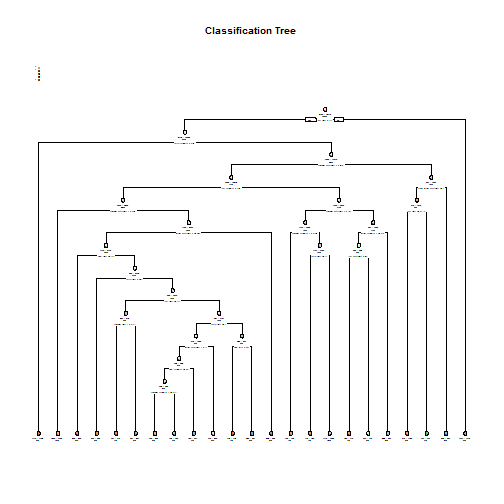

## Objective
The goal of the project is to predict the manner in which they did the exercise. This is the "classe" variable in the training set. The prediction model will also be used to predict 20 different test cases.

## Background
Using devices such as Jawbone Up, Nike FuelBand, and Fitbit it is now possible to collect a large amount of data about personal activity relatively inexpensively. These type of devices are part of the quantified self movement – a group of enthusiasts who take measurements about themselves regularly to improve their health, to find patterns in their behavior, or because they are tech geeks. One thing that people regularly do is quantify how much of a particular activity they do, but they rarely quantify how well they do it. In this project, your goal will be to use data from accelerometers on the belt, forearm, arm, and dumbell of 6 participants. They were asked to perform barbell lifts correctly and incorrectly in 5 different ways. More information is available from the website here: http://web.archive.org/web/20161224072740/http:/groupware.les.inf.puc-rio.br/har (see the section on the Weight Lifting Exercise Dataset).


## Data
The training data for this project are available here:

https://d396qusza40orc.cloudfront.net/predmachlearn/pml-training.csv

The test data are available here:

https://d396qusza40orc.cloudfront.net/predmachlearn/pml-testing.csv


## Approach
This report will use the data from the above source to build multiple models to predict the outcome (classe). During model building we will use a cross validation testing data set to check the accuracy across different models to determine the best model to predict the outcome. Then the best model will be used to predict the 20 test cases.


## Load Data

```r
## Download and load data
setwd("~/Data Science/Files/8/week4")

data_url<-"https://d396qusza40orc.cloudfront.net/predmachlearn/pml-training.csv"
pred_url<-"https://d396qusza40orc.cloudfront.net/predmachlearn/pml-testing.csv"

if (!file.exists('./pml-training.csv')){
        download.file(data_url,destfile<-'pml-training.csv', mode = 'wb')
        }

if (!file.exists('./pml-testing.csv')){
        download.file(pred_url,destfile<-'pml-testing.csv', mode = 'wb')
        }

data_filename="pml-training.csv"
pred_filename="pml-testing.csv"

data<-read.table(data_filename,sep=',',header=TRUE)
pred<-read.table(pred_filename,sep=',',header=TRUE)
```

## Clean up irrelvant data

```r
## take out the irrelvant user info that is not useful in prediction
data<-data[,-c(1:7)]
pred<-pred[,-c(1:7)]

## take out columns with all NA values,to further reduce the number of variables
data<-data[,colSums(is.na(data)) == 0]
pred<-pred[,colSums(is.na(pred)) == 0]

## take out columns with mostly blank/invalid values, to further reduce the number of variables
data<-data[, colSums(data != "") > 500]
dim(data)
```

```
## [1] 19622    53
```


## Create training and testing sets
### Cross validation
75% of the traning set is used for training the model and 25% of the training set is set aside as testing set for cross validation purposes.The model will be applied to the testing set once, to check the accuracy and prediction error to determine the best model.


```r
library(caret)
inTrain<-createDataPartition(y=data$classe,p=0.75,list=FALSE)
training<-data[inTrain,]
testing<-data[-inTrain,]
dim(training)
```

```
## [1] 14718    53
```
## Model buidling strategy
### Model building
I used two methods to compare accuracy.
Ramdom forest method is chosen because it is suitable for non-bionominal outcome & large sample size, which is consistence with the project's data.
The decision tree method is chosen because it's generally suitable for categorical outcomes.

### Model Building 1-Random Forest

```r
library(e1071)
library(randomForest)
model1 <- randomForest(classe ~. , data=training, method="class")
model1
```

```
## 
## Call:
##  randomForest(formula = classe ~ ., data = training, method = "class") 
##                Type of random forest: classification
##                      Number of trees: 500
## No. of variables tried at each split: 7
## 
##         OOB estimate of  error rate: 0.54%
## Confusion matrix:
##      A    B    C    D    E  class.error
## A 4181    3    0    0    1 0.0009557945
## B   14 2831    3    0    0 0.0059691011
## C    0   16 2547    4    0 0.0077911959
## D    0    1   26 2383    2 0.0120232172
## E    0    0    2    8 2696 0.0036954915
```


### Model Building 2-Decision Tree

```r
library(rpart)
library(rpart.plot)
model2 <- rpart(classe ~ ., data=training, method="class")
rpart.plot(model2, main="Classification Tree", extra=102, under=TRUE, faclen=0)
```



## Predictions using model 1 & model 2

### Model 1: Random forest prediction and results

```r
prediction1 <- predict(model1, testing, type = "class")
confusionMatrix(prediction1, testing$classe)
```

```
## Confusion Matrix and Statistics
## 
##           Reference
## Prediction    A    B    C    D    E
##          A 1392    2    0    0    0
##          B    3  946   10    0    0
##          C    0    1  843   22    0
##          D    0    0    2  781    2
##          E    0    0    0    1  899
## 
## Overall Statistics
##                                           
##                Accuracy : 0.9912          
##                  95% CI : (0.9882, 0.9936)
##     No Information Rate : 0.2845          
##     P-Value [Acc > NIR] : < 2.2e-16       
##                                           
##                   Kappa : 0.9889          
##                                           
##  Mcnemar's Test P-Value : NA              
## 
## Statistics by Class:
## 
##                      Class: A Class: B Class: C Class: D Class: E
## Sensitivity            0.9978   0.9968   0.9860   0.9714   0.9978
## Specificity            0.9994   0.9967   0.9943   0.9990   0.9998
## Pos Pred Value         0.9986   0.9864   0.9734   0.9949   0.9989
## Neg Pred Value         0.9991   0.9992   0.9970   0.9944   0.9995
## Prevalence             0.2845   0.1935   0.1743   0.1639   0.1837
## Detection Rate         0.2838   0.1929   0.1719   0.1593   0.1833
## Detection Prevalence   0.2843   0.1956   0.1766   0.1601   0.1835
## Balanced Accuracy      0.9986   0.9968   0.9901   0.9852   0.9988
```

### Model 2: Decision Tree prediction and results

```r
prediction2 <- predict(model2, testing, type = "class")
confusionMatrix(prediction2, testing$classe)
```

```
## Confusion Matrix and Statistics
## 
##           Reference
## Prediction    A    B    C    D    E
##          A 1298  191   25   86   38
##          B   33  492   48   19   41
##          C   35   87  684  147  107
##          D   12   66   49  495   59
##          E   17  113   49   57  656
## 
## Overall Statistics
##                                           
##                Accuracy : 0.7392          
##                  95% CI : (0.7267, 0.7514)
##     No Information Rate : 0.2845          
##     P-Value [Acc > NIR] : < 2.2e-16       
##                                           
##                   Kappa : 0.6682          
##                                           
##  Mcnemar's Test P-Value : < 2.2e-16       
## 
## Statistics by Class:
## 
##                      Class: A Class: B Class: C Class: D Class: E
## Sensitivity            0.9305   0.5184   0.8000   0.6157   0.7281
## Specificity            0.9031   0.9643   0.9071   0.9546   0.9410
## Pos Pred Value         0.7924   0.7773   0.6453   0.7269   0.7354
## Neg Pred Value         0.9703   0.8930   0.9555   0.9268   0.9389
## Prevalence             0.2845   0.1935   0.1743   0.1639   0.1837
## Detection Rate         0.2647   0.1003   0.1395   0.1009   0.1338
## Detection Prevalence   0.3340   0.1291   0.2162   0.1389   0.1819
## Balanced Accuracy      0.9168   0.7414   0.8536   0.7852   0.8346
```

## Discussion-Final Model Selection
### Expected out of sample error
The expected out of sample error depicts how well the model is predicting. The accuracy represents the % of outcome (classe) that is correctly predicted. The higher, the better the model is.

### Decide the final model selection
Comparing the decision tree and random forest model, it's obvious that the random forest model has a higher/better accuracy value. The decision tree model's accuracy is around .7 versus the random forest model's accuracy is higher than 0.9. Thus the random forest model is a better model to predict the outcome (classe) and this model will be used to predict the outcome (classe) for the 20 prediction test cases.


## 20 test cases prediction

```r
prediction3 <- predict(model1, pred, type = "class")
prediction3
```

```
##  1  2  3  4  5  6  7  8  9 10 11 12 13 14 15 16 17 18 19 20 
##  B  A  B  A  A  E  D  B  A  A  B  C  B  A  E  E  A  B  B  B 
## Levels: A B C D E
```


## Citaton
The data for this project come from this source: http://web.archive.org/web/20161224072740/http:/groupware.les.inf.puc-rio.br/har.

More information about the data can be found here:
http://web.archive.org/web/20161224072740/http:/groupware.les.inf.puc-rio.br/har (see the section on the Weight Lifting Exercise Dataset).


